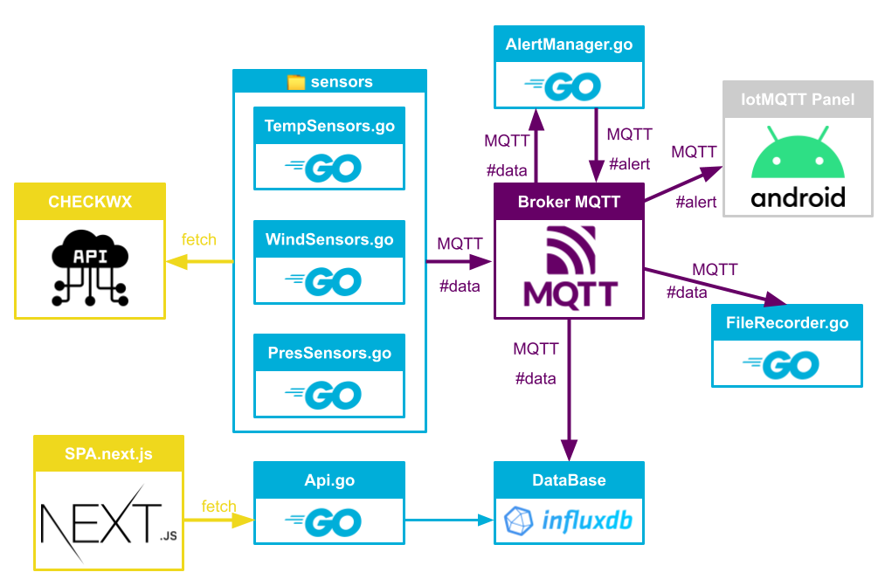

# Projet d'Architecture Distribuée

## Membres du Groupe
- **Tom Freret**
- **Louis Painter**
- **Matthis Bleuet**
- **Antoine Otegui**

## Aperçu
Ce projet, réalisé en Go, a pour objectif de simuler des capteurs (pression, température, vent) dans le contexte aéroportuaire. Il s'agit d'une architecture distribuée, où les microservices communiquent via MQTT.

.

## Organisation du Projet
Utilisation d'un tableau Kanban (JIRA) pour la gestion du projet, en association avec Discord pour la communication.

## Choix Techniques
- **InfluxDB**
- **HiveMQ** en broker MQTT (possibilité d'utiliser mosquitto ou autre broker)
- Quelques librairies :
  - **Logrus** pour les logs
  - **Paho** pour le MQTT
  - **Swaggo** pour la génération de Swagger
  - **Viper** pour charger les configurations et autres
  - **Mux** pour l'API
- Projet **Next.js** pour la SPA

## Structure du Projet :
- `assets` : Images et autres
- `/cmd/` : Fichiers sources de services
- `/configs` : Fichiers de configurations des microservices
- `/docs` : Données du Swagger généré
- `/exe` : Binaires de tous les services
- `/internal` : Code source commun
- `/outputs` : Les fichiers csv de save
- `/web` : La SPA
- `/outputs` : Les fichiers .csv des données

## Instructions de Compilation et d'Exécution

### Docker InfluxDB

Pour lancer le conteneur Docker InfluxDB, utilisez la commande suivante :
```bash
docker compose --env-file ../configs/influxdb.env up
```

### Build et Run

Tous les scripts sont disponibles en .bat et .sh.

- `./BuildAll` : Build des binaires
- `./runAll` : Build puis lance tous les services avec les configurations par défaut
- `./demo` : Lances des capteurs de demos sur différents aéroports
- `./demoAlert` : lances un sensor qui aura des valeurs aberantes //TODO

Pour lancer les services séparément (à la racine et il faut binesur avoir l'instance influxdb lancé et les bianires compilés):

- `./exe/sensors/pressureSensor -config="path/to/config/file"`
- `./exe/sensors/tempSensor -config="path/to/config/file"`
- `./exe/sensors/windSensor -config="path/to/config/file"`
- `./exe/alertManager -config="path/to/config/file"`
- `./exe/fileRecorder -config="path/to/config/file"`
- `./exe/databaseRecorder -config="path/to/config/file" -influx="path/to/env/file"`
- `./exe/api -config="path/to/config/file" -influx="path/to/env/file"`

### Lancer les tests

TODO

### Documentation Swagger

Générez la documentation Swagger en suivant ces étapes :

Assurez-vous que le répertoire go/bin est dans votre

    $PATH (export PATH=$PATH:$GOPATH/bin).

Exécutez la commande suivante à la racine du projet :

    swag init -g cmd/api/main.go

## API :

localhost:8080 : L'API avec les différentes routes :
- .../airports
- .../sensors/sensors/{airportID}
- .../average/{airportID}
- .../average/{airportID}/{sensorType}
- .../data/{airportID}/{sensorType}/{sensorID}
- .../swagger/ : Pour plus d'informations et un playground pour tester les différentes routes
## SPA :

Pour lance la SPA il faut ce placer dans le repo .web
ensuite installer les dependances :

```bash
npm i
```

et ensuite lance l'appli

```bash
npm run dev
```